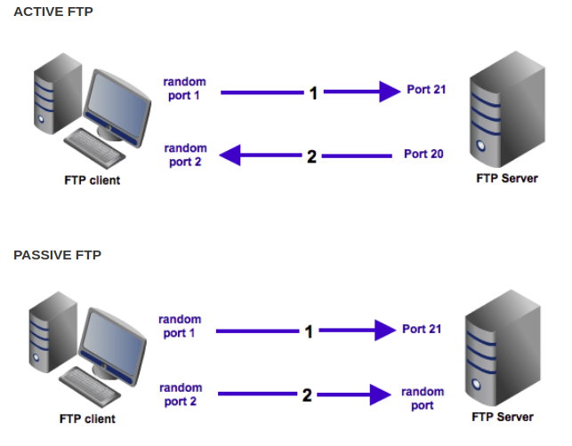

# Glossary of terms

## Contents

- [What is an FTP server?](#What-is-an-FTP-server)
	- [What is FTP used for?](#What-is-FTP-used-for)
	- [Advantages of using an FTP](#Advantages-of-using-an-FTP)
- [What is XML?](#What-is-XML)
- [What is XSD Scheme?](#What-is-XSD-Scheme)
- [References](#References)

## What is an FTP server?

The file transfer protocol in English or its acronym FTP is a network protocol for the transfer of files between systems connected to a TCP network, based on the client-server architecture. From a client computer you can connect to a server to download files from or to send files, regardless of the operating system used on each computer. Basically an FTP server, is a server in which we can upload files, download files and is often used to share files in the cloud or can also be used to upload files on a web page.

### What is FTP used for?

- To upload web pages and edit them.
- To have your files in the cloud and manage them.
- To share files.
- To make backup copies.

### Advantages of using an FTP

- Upload your website quickly.
- There are many different ftp clients.
- Allow to change, create files and directories, change permissions, rename files, delete files.
- Allows to upload in the background.

## What is XML?

XML by its acronym in English, is an Extensible Markup Language, is a metacode that allows to define markup languages that are used to store data in a readable form, comes from the SGML language and allows to define the grammar of specific languages to structure large documents . Unlike other languages, XML is compatible with databases, being useful when several applications must communicate with each other or integrate information. XML was not born only for its application on the Internet, but it is proposed as a standard for the exchange of structured information between different platforms, it can be used: in databases, text editors, spreadsheets and almost anything imaginable.

XML is a simple technology that has others around it that complement it and make it much bigger and with much greater possibilities. It has a very important role in the act as it allows the compatibility between systems to share the information in a safe, viable and easy way. Among the advantages of the XML language is that it can be extended, since after being designed and put into production it is possible to extend it with the addition of new tags, so that it can continue to be used without complications. The analyzer is standard, so it is not necessary to create a specific analyzer for each version of its language, this makes possible the use of any of the possible analyzers, thus avoiding bugs and accelerating the development of applications. If a third party decides to use a document created in XML it is easy to understand its structure and process it, it improves the compatibility between applications.

We can communicate applications from different platforms regardless of the origin of the data, we could have an application in Linux with a Postgress database and communicate it with another application in windows and database. We transform data into information because it adds a specific meaning and is associated with contexts, for which we have flexibility to structure documents.

XML technology seeks to provide a solution to the expression of structured information in the most abstract and reusable way possible, that the information is structured means that it is composed of well-defined parts and that these parts are composed of other parts. Then you have a tree of pieces of information.

## What is XSD Scheme?

The XML Schema language is also referred to as XML Schema Definition (XSD). The purpose of an XML Schema is to define the legal building blocks of an XML document:

-   The elements and attributes that can appear in a document.
-   The number of (and order of) child elements.
-   Data types for elements and attributes.
-   Default and fixed values for elements and attributes.

## References

https://www.youtube.com/watch?v=flpugX8DSvQ
https://www.youtube.com/watch?v=ALcWnkIznPk
https://www.w3schools.com/xml/schema_intro.asp
https://blogs.msdn.microsoft.com/mast/2013/12/12/setting-up-a-passive-ftp-server-in-windows-azure-vm/
https://www.geeksforgeeks.org/computer-network-file-transfer-protocol-ftp/
<!--stackedit_data:
eyJoaXN0b3J5IjpbLTE4Mzg2Nzc0NCwtMTg5ODk1OTQzMiw2Mj
g0NjY0NywtNTM4NjE3MjE2LDIwNTU0MTY2MDEsNzQxNjE4MjMz
LDE4NjM3MTc2MzEsLTEzNzg2NDc0NTgsLTE0MzUwNTM2MjYsMT
k2MjM1MDgwN119
-->